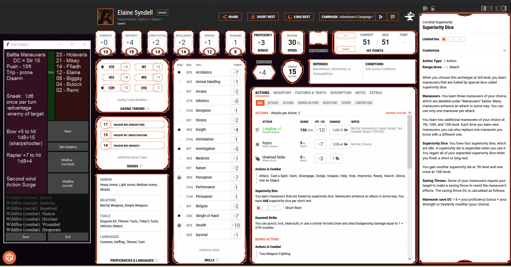

# DnD_Sidebar

DnD Beyond wastes valuable screenspace on the left of 1920*1080 screens - this uses it for ..stuff....

This is 'always on top' - that is kind of the whole point

Saves notes and names
2 buttons for custom functions
Scrolling text box for button results
Initative tracker was not worth the effort - but it works
Large buttons meant for touch screens

Code gets a bit spaghetti, so button functions are at the top.
The dice() func takes 2 or 3 args to represent a statement like: 2d4+1 = dice(2,4,1) or 3d8 = dice(3,8)

